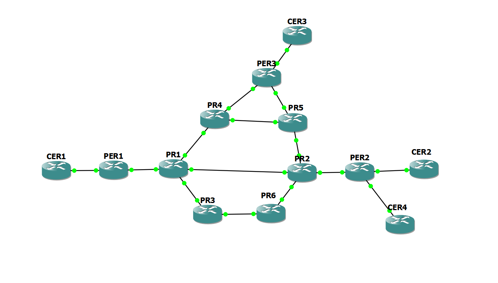

# NasProject
**INSA of Lyon student project of NAS**
**3TCA Alan/Etienne/Lucas/Ryad/Zineb**
**
# Installation:
Clone this repository to your favorite folder.
Next you need to configure the "ConfigIntention.json" file according to your GNS3 project.
# Fonctionnement:
Launch your GNS3 with cisco router connected like you want to form YOUR topology.

Name your router like this:
- Provider Edge router : PER[number] 
- Provide router : PR[number]
- Customer Edge : CE[number]

[number] is any digit you want, 2 router can't have the same name

**Example:** 

Caution: In `edit/preference` in gns3, section `server`. Unticked the `protect server with password` option.

Now, you can launch your router, wait 5-10 sec (for the router to be ready)

Launch the script. The CER1 and CER2 can ping each other.

To do :
- 
- Customer router and wich customer specify in JSON
- Personalize the Route-Target in a Client
- RouteReflector ?